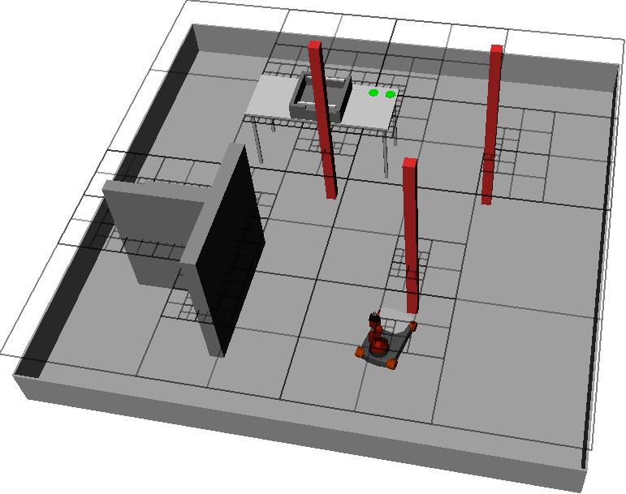
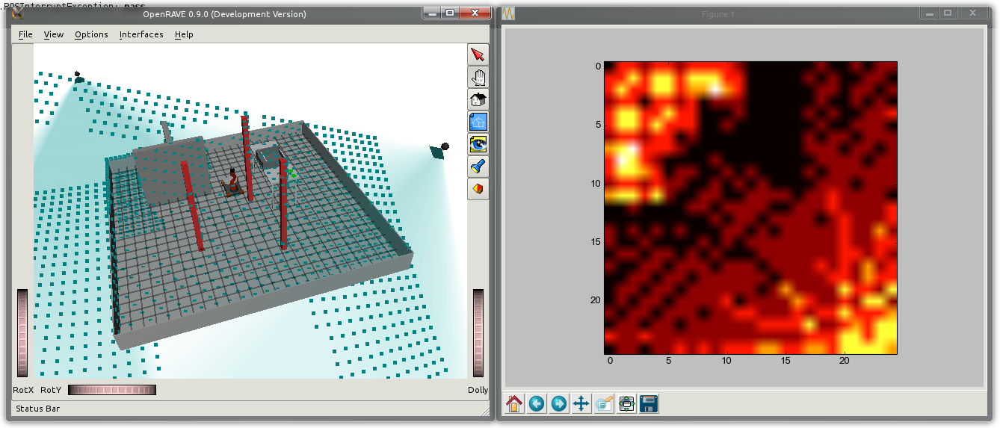
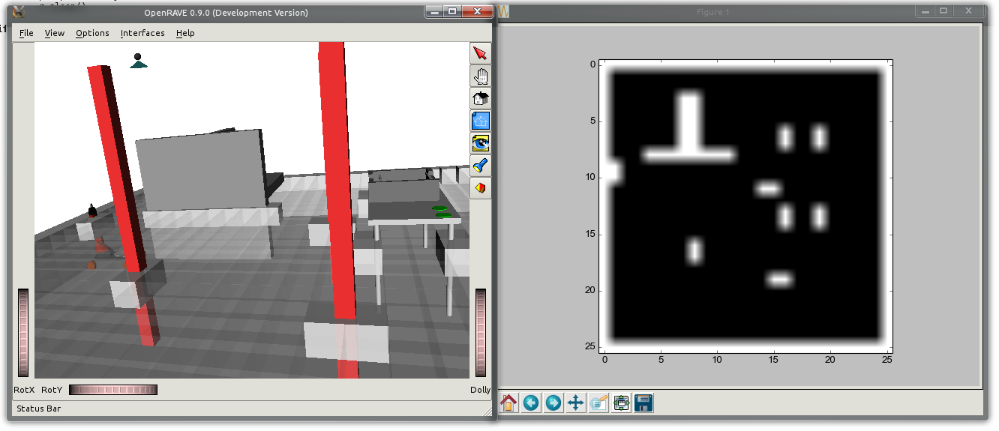
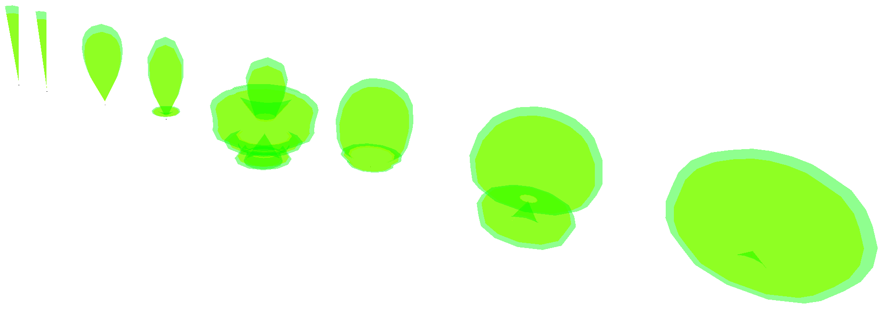

# OpenRAVE - Plugins

This repository hosts some of our plugins, developed for the OpenRAVE robotic
simulator. Currently there are three plugins available:

## 1. distance_sensor

This plugin was developed to use more realistic distance sensors within a
robotic simulation. Different shapes of sensor beams can be defined by using
simple meshes. The youBot random walk example in the video below shows the usage
of this OpenRAVE plugin. The front sensors have a typical infrared shape, while
side and back sensors have a typical utrasonic beam. Using meshes it is easy to
extend this plugin and to imitate various different distance sensors.

[](http://www.youtube.com/watch?v=Ts7Acf70D8U "watch on YouTube")

## 2. filter

This plugin was intended to filter different simulation scenarios, and thus to
generate more abstract views. As you can see in the video, two grids were placed
to cut through the scenario and generate online different occupancy grid maps
for different heights. This plugin was intended to be extended and used as a
base for further filters.

[](http://www.youtube.com/watch?v=DTX2pXk5Q2Q "watch on YouTube")

### 2.1 quadtrees



### 2.2 sensorcoverage



### 2.3 sensordistance


### 2.4 occupancycubes



### 2.5 and more ...


## 3. trace

Sometimes it is required to keep track of an object and its trajectory during a
simulation. This simple plugin was intended to do so. Just attach this element
like an sensor to any robot, link, or object and visualize historical positions.

[](http://www.youtube.com/watch?v=f_TOxP75buk "watch on YouTube")


## 4. situated_sensor

This plugin allows to measure within the virtual world as well as in the real
world, by connecting a sensor to a ROS topic.



## Installation

Simply download the project via:

```bash
git clone https://github.com/andre-dietrich/OpenRAVE-Plugins.git
```
go into every directory, for example

```bash
cd distance_sensor
```

and then run

```bash
cmake .
sudo make install
```
every project contains a test folder with a python script.
